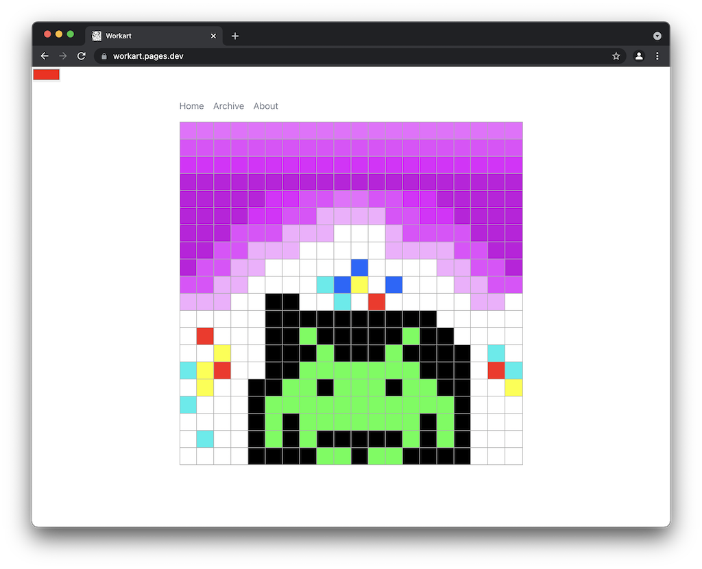

# workart

Try now: https://workart.pages.dev/

A collaborative [pixel art](https://en.wikipedia.org/wiki/Pixel_art) web tool for creating new art every day.

## About

Built for the [Cloudflare Developer 2021
Summer Challenge](https://challenge.developers.cloudflare.com/). This is a lighthearted project that utilizes:

- [Cloudflare Pages](https://pages.cloudflare.com/)
- [Cloudflare Workers](https://workers.cloudflare.com/)
- [Cloudflare Workers KV](https://www.cloudflare.com/products/workers-kv/)
- [Vue 3](https://v3.vuejs.org/)

Each pixel artboard is wiped clean each day, and anyone can add pixels to the board. There is no guarantee your pixel will stay the same and each new day resets the board. After the day has passed, the art is frozen and can be accessed via the archive.

